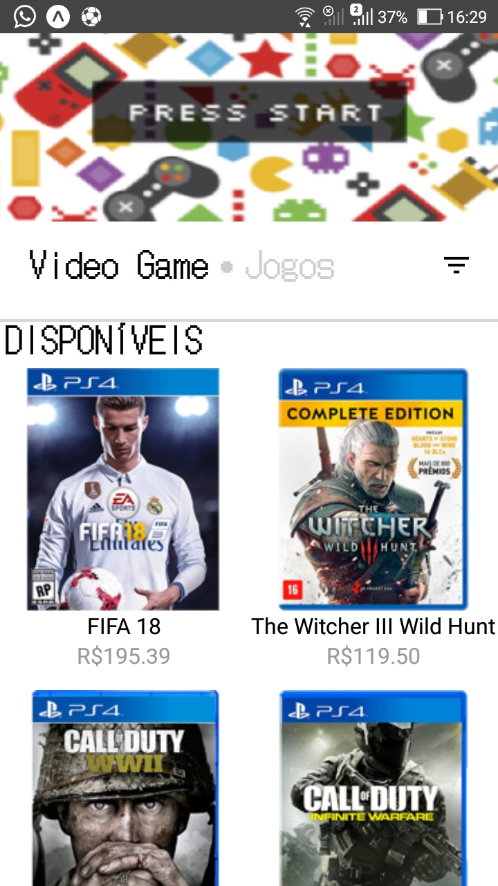
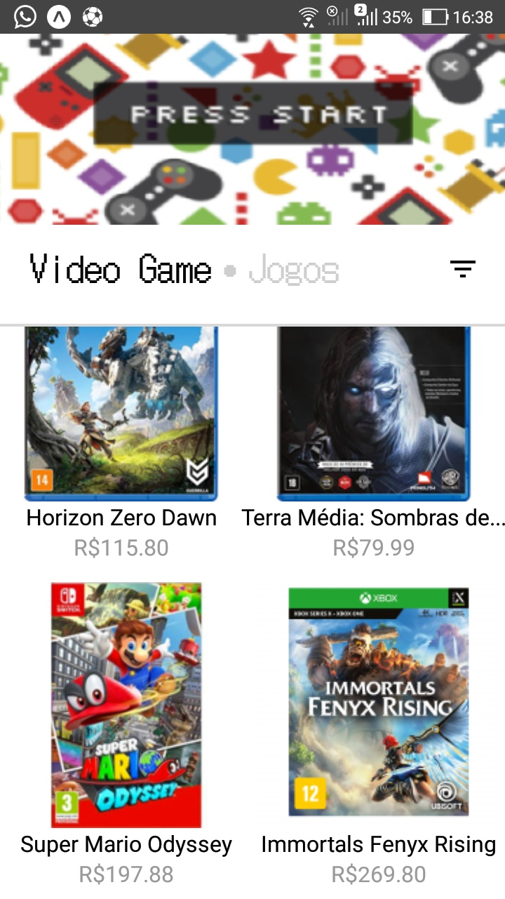

<h1 align="center">
    
</h1>

# Indice

- [Sobre](#-sobre)
- [Tecnologias Utilizadas](#-tecnologias-utilizadas)
- [Criando o projeto](#-criando-o-projeto)

## 🔖&nbsp; Sobre

O projeto em desenvolvimento é um e-commerce que foi criado como teste para avaliação e para fins de estudo.


<p align="center">
  <kbd>
    
  </kbd>
  &nbsp;&nbsp;&nbsp;&nbsp;
  <kbd>
    
  </kbd>
  &nbsp;&nbsp;&nbsp;&nbsp;
  <kbd>
    
  </kbd>
</p>

## 🚀 Tecnologias utilizadas

O projeto foi desenvolvido utilizando as seguintes tecnologias

- [React Native](https://reactnative.dev/docs/getting-started)
- [Expo](https://expo.dev/)
- [React Navigation](https://reactnavigation.org/docs/getting-started/)

## 🗂 Criando o projeto

```bash

    # Instale as ferramentas de linha de comando
    $ npm install --global expo-cli

    # Criar o repositório
    $ expo init app-compregames

    # Instalar as ferramentas
    $ yarn add @react-navigation/native
    $ expo install react-native-screens react-native-safe-area-context
    $ expo install react-native-gesture-handler react-native-reanimated @react-native-masked-view/masked-view
    $ yarn add @react-navigation/stack
    $ expo install @expo-google-fonts/dotgothic16 expo-font expo-app-loading

    # Iniciar o projeto
    $ yarn start 
  ```
  ---
    
   
	 🚧  Carrinho de compras  🚀 Em construção...  🚧
   
   
   Desenvolvido por Luís Henrique.
    


